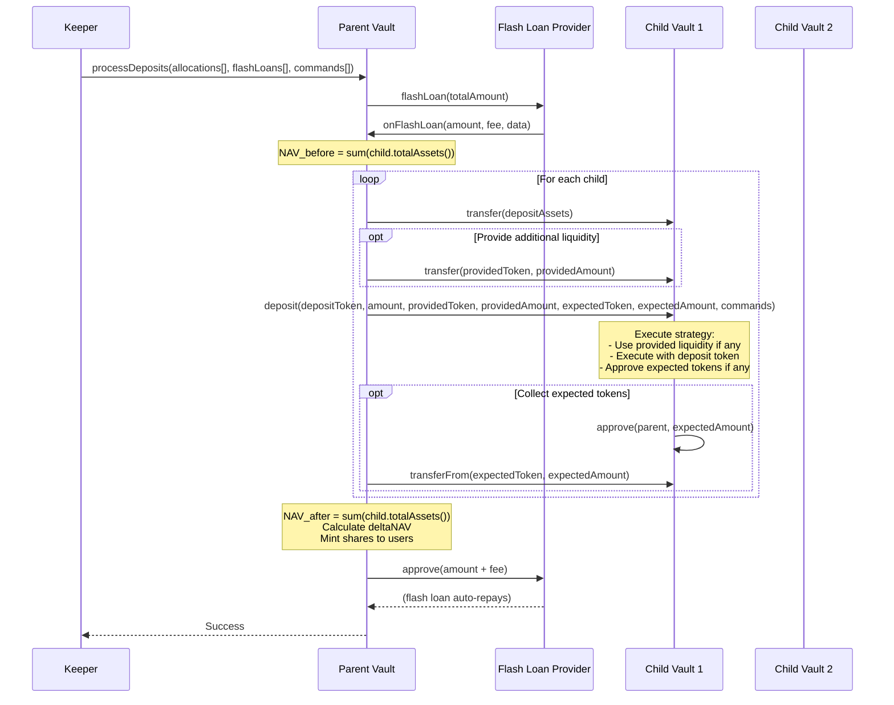
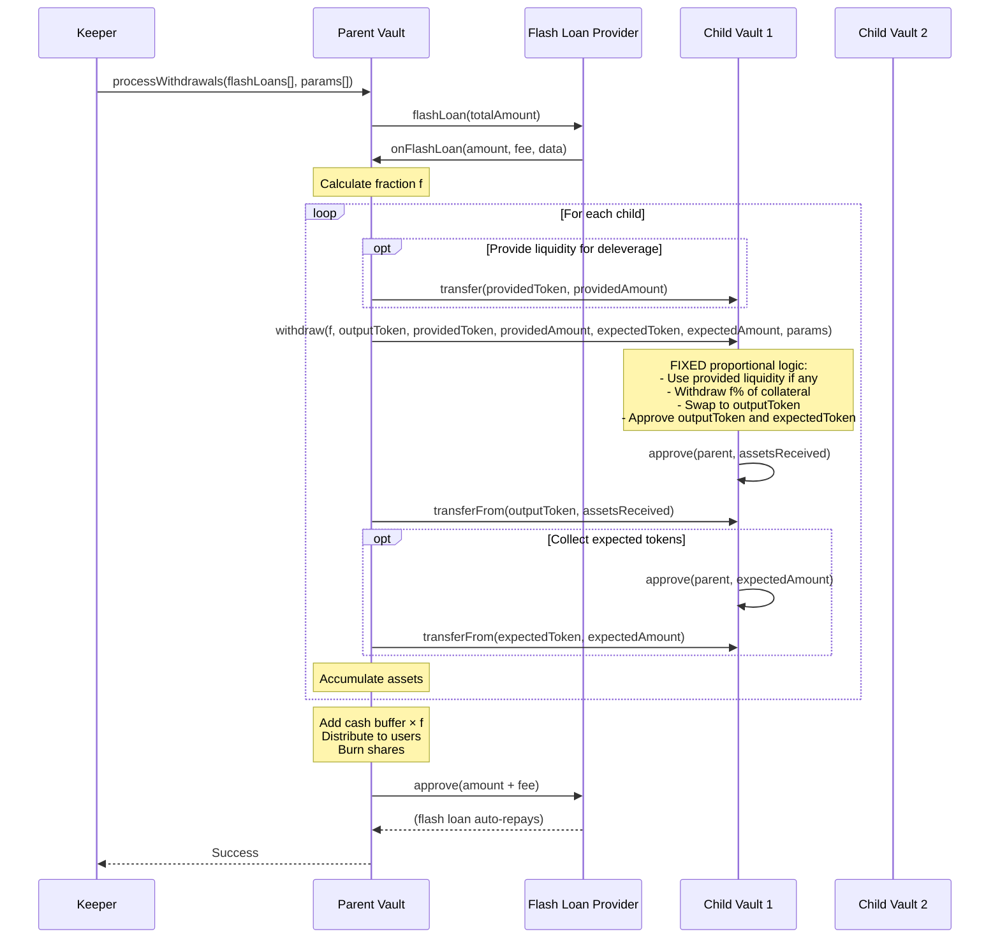
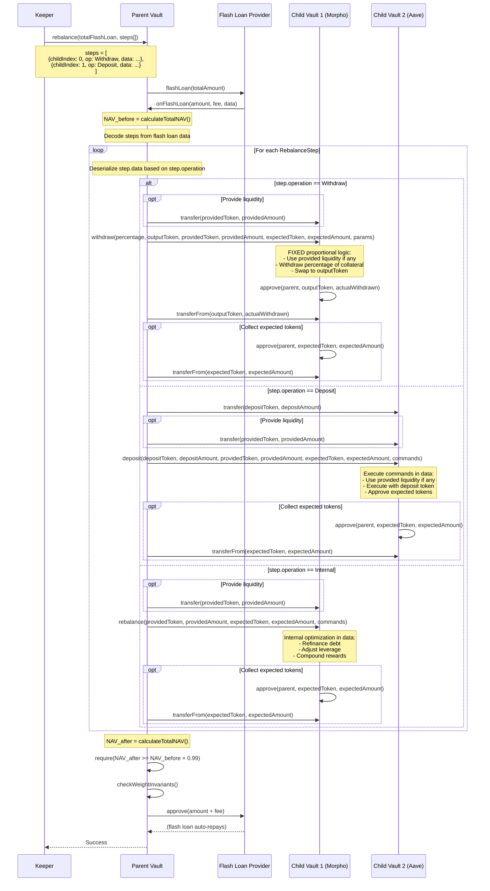

# ADR-0005: Deposit & Withdrawal Settlement

## Status
Accepted

## Date
2024-10-01

## Context
We need fair batching without oracle reliance, supporting multiple children and proportional exits.

## Requirements
- **Batched deposits:** users get receipts; no instant mint.
- **Atomic epoch:** one keeper tx executes allocation + mint/burn.
- **Entry fairness:** use deltaNAV; do not dilute existing holders.
- **Exit proportionality:** withdraw exact fraction f of every asset (incl. cash buffer).
- **No substitution:** cash buffer can only cover its proportional share.
- **Partial fills:** if some child is illiquid, deliver what’s realizable and queue the rest.
- **Idempotency:** safe re-runs on tx failure.

**Related Requirements:**
- [FR-001: User Deposits and Withdrawals](../requirements/functional-requirements.md#fr-001-user-deposits-and-withdrawals)
- [FR-004: Flash Loan Management](../requirements/functional-requirements.md#fr-004-flash-loan-management)
- [TR-006: Flash Loan Implementation](../requirements/technical-requirements.md#tr-006-flash-loan-implementation)
- [TR-007: Error Handling and Atomicity](../requirements/technical-requirements.md#tr-007-error-handling-and-atomicity)
- [SR-003: Flash Loan Security](../requirements/security-requirements.md#sr-003-flash-loan-security)

## Decision

### Deposit Flow

**User Submission:**
1. User calls `deposit(uint256 assets, uint256 minSharesOut)` with underlying token (e.g., USDC)
2. Assets are transferred to parent vault
3. Deposit request is stored in contract storage (not NFT):
   ```solidity
   struct DepositRequest {
       address user;
       uint256 assets;
       uint256 minSharesOut;  // slippage protection
   }
   ```
4. Users can make multiple deposits in same epoch (separate requests)
5. Users can cancel pending deposits before epoch processing

**Epoch Processing (`processDeposits()` called by keeper):**
1. Initialize NAV accumulators:
   ```
   NAV_before = 0
   NAV_after = 0
   ```
2. Keeper determines allocation to children based on:
   - Available liquidity in protocols
   - Lending limits not exceeded
   - Target weights and thresholds (ADR-0003)
3. Calculate NAV before any child operations:
   ```solidity
   NAV_before = 0;
   for each child:
       NAV_before += child.totalAssets();
   ```
4. Execute deposits to children:
   ```solidity
   for each child:
       // Transfer deposit assets to child
       IERC20(depositToken).transfer(address(child), depositAmount);

       // Transfer provided liquidity if needed
       if (providedToken != address(0)) {
           IERC20(providedToken).transfer(address(child), providedAmount);
       }

       // Execute deposit with provided/expected pattern
       child.deposit(
           depositToken, depositAmount,
           providedToken, providedAmount,
           expectedToken, expectedAmount,
           commands
       );

       // Collect expected tokens from child
       if (expectedToken != address(0)) {
           IERC20(expectedToken).transferFrom(address(child), address(this), expectedAmount);
       }
   ```
5. Calculate NAV after all child operations:
   ```solidity
   NAV_after = 0;
   for each child:
       NAV_after += child.totalAssets();
   ```
5. Account for parent's cash buffer (excluding current pending deposits):
   ```
   // NAV_before: strategies + cash that existed before this epoch started
   // NAV_after: strategies + cash that remains after allocations this epoch
   NAV_before += parentCashBefore;      // cash carried over from previous epochs
   NAV_after += parentRemainingCash;    // cash kept for liquidity after allocations
   ```
   **Important:** Assets supplied by users in the current epoch are excluded from `NAV_before` until deployed into strategies.
6. Calculate minted shares:
   ```
   deltaNAV = NAV_after - NAV_before
   pricePerShare = (totalSupply == 0) ? 1e18 : (NAV_before / totalSupply)
   totalNewShares = deltaNAV / pricePerShare
   ```
7. Distribute shares pro-rata to deposit requests:
   ```
   userShares = (userAssets / totalQueuedAssets) × totalNewShares
   ```
8. Verify `userShares >= minSharesOut` for each request (revert if any fails)
9. Transfer shares to users, clear deposit queue

### Withdrawal Flow

**User Submission:**
1. User calls `requestWithdrawal(uint256 shares, uint256 minAssetsOut)`
2. Shares are locked (not burned yet)
3. Withdrawal request stored in contract storage:
   ```solidity
   struct WithdrawalRequest {
       address user;
       uint256 shares;
       uint256 minAssetsOut;  // slippage protection
   }
   ```
4. Users can make multiple withdrawal requests in same epoch
5. Users can cancel pending withdrawals before epoch processing

**Epoch Processing (`processWithdrawals()` called by keeper):**
1. Calculate total shares to withdraw from queue
2. Compute fraction: `f = totalWithdrawalShares / totalSupply`
3. Withdraw proportionally from each child strategy:
   ```solidity
   for each child:
       // Transfer provided liquidity to child if needed
       if (providedToken != address(0)) {
           IERC20(providedToken).transfer(address(child), providedAmount);
       }

       // Execute proportional withdrawal with provided/expected pattern
       uint256 assetsReceived = child.withdraw(
           f,                       // percentage (1e18 = 100%)
           outputToken,             // USDC or base asset
           providedToken,           // flash loan token (or address(0))
           providedAmount,          // flash loan amount (or 0)
           expectedToken,           // token parent expects back (or address(0))
           expectedAmount,          // expected amount (or 0)
           params                   // execution parameters
       );

       // Collect withdrawn assets
       IERC20(outputToken).transferFrom(address(child), address(this), assetsReceived);

       // Collect expected tokens if any
       if (expectedToken != address(0)) {
           IERC20(expectedToken).transferFrom(address(child), address(this), expectedAmount);
       }

       totalAssetsReceived += assetsReceived;
   ```
4. Add parent's cash buffer: `totalAssetsReceived += cashBuffer × f`
5. Distribute assets proportionally to withdrawal requests:
   ```
   userAssets = (userShares / totalWithdrawalShares) × totalAssetsReceived
   ```
6. Verify `userAssets >= minAssetsOut` for each request (revert if any fails)
7. Burn shares from users
8. Transfer assets to users (or queue if partially filled)

**Partial Fills (illiquidity handling):**

Keeper calculates available liquidity before calling `processWithdrawals()`:
1. Check each child's withdrawable amount
2. Calculate total available liquidity across all children + cash
3. If insufficient for all requests → process only partial fulfillment

**Withdrawal Request tracking:**
```solidity
struct WithdrawalRequest {
    address user;
    uint256 sharesRequested;    // original request
    uint256 sharesFulfilled;    // cumulative fulfilled across epochs
    uint256 minAssetsOut;       // slippage protection
}
```

**Partial fulfillment process:**
1. Keeper processes only what's liquid (e.g., 60% of queue)
2. Users with fulfilled requests receive assets
3. Remaining 40% stays queued with `sharesFulfilled` updated
4. Next epoch: keeper checks liquidity again and processes more
5. Shares burned incrementally as each portion is fulfilled

## Flash Loan Architecture

**Key Design:** Parent vault manages all flash loans to coordinate complex operations across children.

### Why Parent Manages Flash Loans

1. **Single flash loan** for multiple children (coordination efficiency)
2. **Atomic coordination** across deposit/withdraw/rebalance operations
3. **Simple child vaults** - children don't manage flash loan lifecycle
4. **Enables cross-child migrations** - move leveraged positions between strategies

### Flash Loan Provider

**Primary provider: Morpho (zero fee flash loans)**
- Sufficient liquidity for protocol operations
- Zero fees simplify accounting (no fee distribution needed)
- If Morpho liquidity insufficient in future, can add other providers with fee handling

### Operation Types

Parent's `onFlashLoan` callback handles different operation types:

```typescript
enum OperationType {
    DEPOSIT,            // processDeposits - user deposits to children
    WITHDRAW,           // processWithdrawals - user withdrawals from children
    REBALANCE           // rebalance - move assets between children or optimize within single child
}
```

### Flow Pattern

```
Parent Operation
  → Flash Loan Provider: flashLoan(totalAmount)
    → Parent: onFlashLoan(operation, data)
      → Decode operation type
      → Child operations (transfer liquidity + call functions)
      → Collect repayments (transferFrom approved amounts)
      → Return to flash loan callback
    → Flash loan auto-repays
```

### Deposit Flow with Flash Loan



### Withdrawal Flow with Flash Loan



### Unified Rebalance Flow

Parent vault's single `rebalance()` function handles all rebalancing operations through a step-based approach:



**Example step configurations:**

1. **Cross-child migration (Morpho → Aave):**
```typescript
steps = [
  {
    childIndex: 0,
    operation: RebalanceOp.Withdraw,
    data: encode(
      1e18,                    // percentage: 100%
      PT_TOKEN,                // outputToken: receive PT
      USDT_TOKEN, 2000e6,      // providedToken/Amount: flash loan for deleverage
      address(0), 0,           // expectedToken/Amount: parent keeps liquidity
      morphoParams
    )
  },
  {
    childIndex: 1,
    operation: RebalanceOp.Deposit,
    data: encode(
      PT_TOKEN, ptAmount,      // depositToken/Amount: deposit received PT
      address(0), 0,           // providedToken/Amount: no additional liquidity
      USDT_TOKEN, 2000e6,      // expectedToken/Amount: strategy borrows and returns
      aaveCommands
    )
  }
]
```

2. **Internal optimization:**
```typescript
steps = [
  {
    childIndex: 0,
    operation: RebalanceOp.Internal,
    data: encode(
      USDC_TOKEN, 1000e6,      // providedToken/Amount: flash loan for refinancing
      USDC_TOKEN, 1000e6,      // expectedToken/Amount: expect flash loan back
      refinanceCommands
    )
  }
]
```

3. **Complex multi-step rebalancing:**
```typescript
steps = [
  {childIndex: 0, operation: Withdraw, data: ...},
  {childIndex: 1, operation: Withdraw, data: ...},
  {childIndex: 2, operation: Deposit, data: ...},
  {childIndex: 0, operation: Internal, data: ...}
]
```

### Error Handling
- **Atomic execution:** All operations in `processDeposits()` are atomic
- If any child deposit/withdrawal fails → entire epoch reverts
- No partial state changes
- Keeper can retry with adjusted parameters (different allocation, different commands)

### Rebalancing Overview

Parent vault implements unified `rebalance()` for all rebalancing operations (see unified flow diagram above).

**When needed:**
- Actual weights drift beyond target ± threshold
- Migration to new strategy
- Response to changing market conditions
- Internal child optimization (refinance, leverage adjustment, rewards)

**Security:**
- Withdrawal operations use fixed proportional logic (same as user withdrawals)
- Deposit operations use deltaNAV accounting (same as user deposits)
- Internal operations protected by NAV invariant checks
- Additional NAV and weight invariant checks after all steps complete

See ADR-0003 for detailed unified rebalance design.

### Access Control
- **Keeper role:** Backend service that calls `processDeposits()`, `processWithdrawals()`, and `rebalance()`
- Keeper decides when and where to allocate assets
- Keeper must respect on-chain invariants:
  - Target weight percentages and thresholds (ADR-0003)
  - Slippage protection (`minSharesOut` for deposits, `minAssetsOut` for withdrawals)
  - Single-owner constraint (only parent can call child vaults)
  - NAV preservation (rebalance cannot significantly decrease NAV)
- Keeper provides optimized execution paths via commands (ADR-0002)

## Consequences
- No NAV-based over/underpayments.
- Predictable proportional exits, with transparent partial-fill queues.
- Atomic epoch processing ensures consistency (all-or-nothing).
- Keeper has flexibility within strict on-chain guardrails.

## Related ADRs
- [ADR-0003: Vault Architecture v2](0003-vault-architecture.md) - Defines overall epoch-based architecture and multi-child allocation
- [ADR-0004: NAV Calculation Method](0004-nav-calculation-method.md) - NAV snapshots used in processEpoch

## Requirements Traceability
- **FR-001.1**: Deposit Flow - Implemented through batch deposits with epoch processing and slippage protection
- **FR-001.2**: Withdrawal Flow - Implemented through proportional withdrawals with partial fill support
- **FR-001.3**: Fair Entry/Exit - deltaNAV-based entry and proportional asset distribution
- **FR-004.1**: Flash Loan Coordination - Parent vault manages all flash loans for operation coordination
- **FR-004.2**: Operation Types - DEPOSIT, WITHDRAW, REBALANCE operations supported
- **TR-006.1**: Flash Loan Provider - Morpho as primary provider with zero fees
- **TR-006.2**: Operation Types - OperationType enum implemented for callback handling
- **TR-007.1**: Atomic Execution - All operations atomic with no partial state changes
- **TR-007.2**: Idempotency - Safe re-runs and consistent state after failures
- **SR-003.1**: Flash Loan Constraints - Repayment within same transaction enforced
- **SR-003.2**: Flash Loan Validation - Data validation and provider authorization
